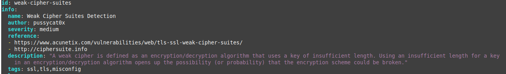
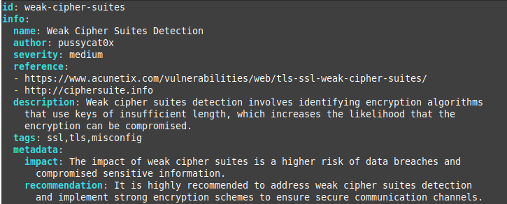

# template-enhancer
The tool queries the OpenAI API to enhance the description, impact, and recommendation keys of a nuclei template.

Usage:

```
pip install -r requirements.txt
```

```
python3 enhance-template.py <path-to-nuclei-template>
```

Or bash one-liner to run the script over multiple templates.

```
$high=$(nuclei -tl -s high); for i in $(echo $high); do python3 enhance-template.py $i ; done
```
This ```$high=$(nuclei -tl -s high)``` lists nuclei templates that have high severity and stores them in variable called "high".

This ```for i in $(echo $high); do python3 enhance-template.py $i ; done``` loops over each file-name in "high" variable and runs the script against them.

Before:




After:



